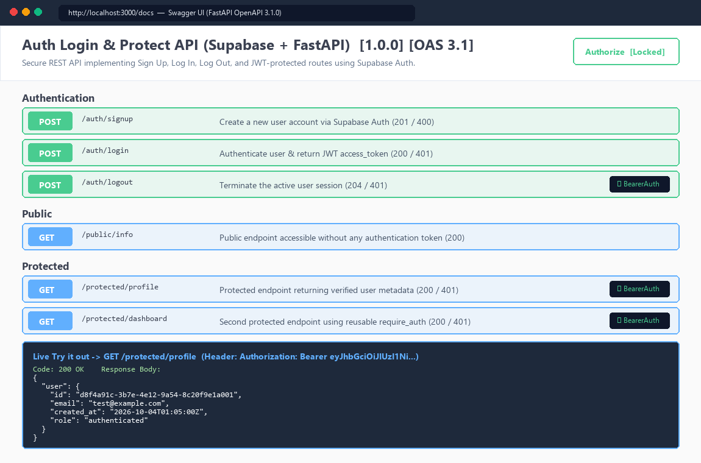

# Auth — Login & Protect (Supabase Auth + FastAPI + JWT Middleware)

> **Track**: FlyRank Internship · Backend Development Track · Auth — Login & Protect  
> **Lane**: Python (`FastAPI` + `supabase` SDK + built-in OpenAPI/Swagger UI at `/docs`)

---

## 1. What This Project Is

In previous assignments, our API endpoints were open to any caller. This project secures a FastAPI backend using **Supabase Auth** as the **Identity Provider (IdP)** and **JSON Web Tokens (JWTs)** for stateless route protection.

### The Trust Triangle Architecture

```text
1. Sign Up / Log In:  Client  ──(email + password)──►  FastAPI  ──►  Supabase Auth (IdP)
2. Issue JWT Pass:    Supabase Auth  ──(signed JWT access_token)──►  Client
3. Protected Request: Client  ──(Authorization: Bearer <token>)──►  FastAPI Middleware (require_auth)
4. Token Verification: FastAPI Middleware  ──(supabase.auth.get_user(token))──►  200 OK or 401 Unauthorized
```

---

## 2. How to Set Up Local Environment Variables

1. Create a free project at [supabase.com](https://supabase.com/) and navigate to **Project Settings $\rightarrow$ API**.
2. Copy `.env.example` to `.env` inside `Auth - Login & protect/`:
   ```bash
   cp .env.example .env
   ```
3. Fill in your `SUPABASE_URL` and `SUPABASE_KEY` (`anon` public key):
   ```ini
   SUPABASE_URL=https://your-project-id.supabase.co
   SUPABASE_KEY=your-public-anon-key
   PORT=3000
   ```
   *(Note: `.env` is listed in [`.gitignore`](./.gitignore) so private credentials are never committed to GitHub.)*

---

## 3. How to Run the Server (Single Command)

Install dependencies and start the server on port `3000`:

```bash
pip install -r requirements.txt
uvicorn main:app --reload --port 3000
```

Or run directly with Python:
```bash
python main.py
```

### Run the Automated Verification Suite (`pytest`)
```bash
pytest test_auth.py -v
```

---

## 4. API Reference Table

| Method | Endpoint | Auth Required? | Request Body / Header | Success Status | Error Statuses | Purpose |
| :---: | :--- | :---: | :--- | :---: | :---: | :--- |
| `POST` | `/auth/signup` | ❌ No | `{"email": "...", "password": "..."}` | `201 Created` | `400 Bad Request` | Register a new user account in Supabase Auth. |
| `POST` | `/auth/login` | ❌ No | `{"email": "...", "password": "..."}` | `200 OK` *(returns `access_token` & `refresh_token`)* | `400 Bad Request`<br>`401 Unauthorized` | Authenticate user credentials and return a signed JWT. |
| `POST` | `/auth/logout` | ✅ **Yes (`Bearer <token>`)** | `Authorization: Bearer <token>` | `204 No Content` | `401 Unauthorized` | Verify active session token and terminate session via `supabase.auth.sign_out()`. |
| `GET` | `/public/info` | ❌ No | None | `200 OK` | — | Return public information accessible to any visitor. |
| `GET` | `/protected/profile` | ✅ **Yes (`Bearer <token>`)** | `Authorization: Bearer <token>` | `200 OK` *(returns verified user metadata)* | `401 Unauthorized` | Protected route guarded by `require_auth` middleware/dependency. |
| `GET` | `/protected/dashboard` | ✅ **Yes (`Bearer <token>`)** | `Authorization: Bearer <token>` | `200 OK` | `401 Unauthorized` | Second protected route proving reusable middleware guard. |

---

## 5. Swagger UI (`/docs`) with Bearer Token Authorization

FastAPI's `HTTPBearer` security scheme (`BearerAuth`) is wired into [`auth_middleware.py`](./auth_middleware.py). Opening `http://localhost:3000/docs` displays the **Authorize** padlock button at the top right and lock icons next to `/auth/logout`, `/protected/profile`, and `/protected/dashboard`:


