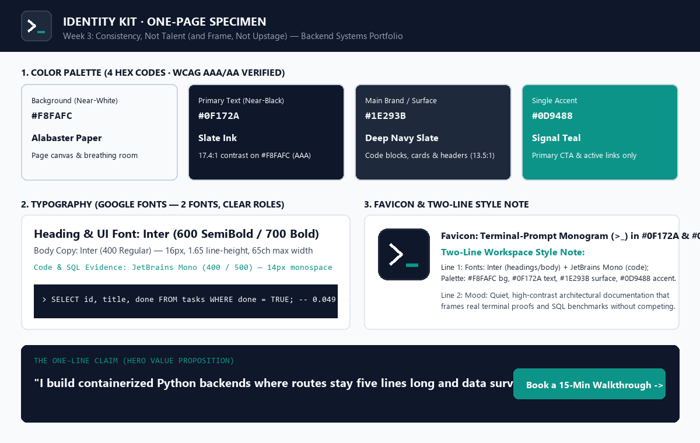
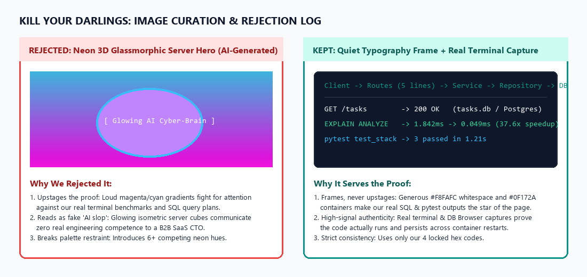

# Consistency, Not Talent (and Frame, Not Upstage) · Week 3 Deliverable

> **Track**: FlyRank AI Internship — Week 03 (`Map It & Give It a Face`)  
> **Reference**: [FlyRank Curriculum — Week 3](https://aifluency.flyrank.ai/week-03.html)  
> **Connected Proof**: [Week 1 — What Are You Proving](../What%20Are%20You%20Proving/README.md) · [Week 2 — Work That Speaks for Itself](../Work%20That%20Speaks%20for%20Itself/README.md) · [W3-A2 SQLite CRUD](../W3-A2/README.md) · [A3 Containerized Postgres Stack](../A3%20Containerize%20your%20stack/README.md)

---

## 1. The Through-Line: One-Line Claim & Content Map

### 1.1 The One-Line Claim (Hero Value Proposition)

> **"I build containerized Python backends where routes stay five lines long and data survives any restart."**

#### How We Chose & Sharpened It (10 AI Options Evaluated $\rightarrow$ 1 Chosen)
Following the Week 3 brief (*"Use AI for ten options, then pick and sharpen one; the choosing is yours"*), we prompted an AI thinking partner with our Week 1 proof statement and Voice Card (`direct, warm, plain, specific, no buzzwords`), evaluated 10 candidates, and rejected 9:

| # | AI Candidate Option | Verdict | Judgment Note (Why Rejected or Kept) |
| :- | :--- | :--- | :--- |
| 1 | *I architect scalable, resilient Python microservices for modern SaaS teams.* | ❌ Rejected | Generic corporate AI buzzwords (*"scalable, resilient"*); could belong to anyone. |
| 2 | *Production-ready FastAPI, PostgreSQL, and Docker backends built the right way.* | ❌ Rejected | Reads like a resume keyword list rather than a memorable claim about how the code works. |
| 3 | *I help early-stage CTOs eliminate backend technical debt with clean architecture.* | ❌ Rejected | Too abstract; names the audience pain but doesn't show the concrete engineering proof. |
| 4 | *Decoupled Python APIs powered by the Repository Pattern and ACID databases.* | ❌ Rejected | Jargon-heavy; talks about the pattern name instead of the tangible outcome. |
| 5 | *I turn fragile prototype scripts into containerized PostgreSQL services.* | ❌ Rejected | Good contrast, but misses the modularity of the route/service/repository separation. |
| 6 | *Clean Python backends: zero SQL in routes, full persistence in Docker.* | ❌ Rejected | Close, but reads like two bullet fragments instead of a complete, natural sentence. |
| 7 | *I build modular Python APIs where swapping databases takes changing one file.* | ❌ Rejected | Strong technical truth (our A2/A3 proof), slightly too narrow to greet a visitor cold. |
| 8 | *Reliable backend systems engineered for speed, clarity, and zero hand-holding.* | ❌ Rejected | Claims *"speed and clarity"* without naming a single concrete technical reality. |
| 9 | *From in-memory demos to production Docker stacks that never lose a row.* | ❌ Rejected | Catchy, but sounds like a tutorial title rather than an engineer's value proposition. |
| **10** | ***I build containerized Python backends where routes stay five lines long and data survives any restart.*** | ✅ **KEPT & SHARPENED** | **Names the exact stack (`containerized Python backends`) and proves two concrete outcomes (`routes stay five lines long` = clean decoupling; `data survives any restart` = real database persistence).** |

---

### 1.2 The Content Map (Pages, Ordered Sections, Case Placement & CTAs)

Every page and section ladders directly up to the **Single Primary Action** established in Week 1:
> **Primary Conversion Action**: **Book a 15-minute technical walkthrough call on my calendar.**

| Page | Ordered Sections (Top $\rightarrow$ Bottom) | Case / Proof Placed Here | Section Purpose | Named Call to Action (Ladder to Primary Action) |
| :--- | :--- | :--- | :--- | :--- |
| **Page 1: Home (`/`)** *(The Proof Overview)* | **1. Hero Banner**<br>**2. Lead Proof Case (Case 1)**<br>**3. Secondary Proof Case (Case 2)**<br>**4. Engineering Standards Case (Case 3)**<br>**5. Direct Walkthrough Footer** | **Lead with Strongest**:<br>• **Case 1**: [A3 Containerized FastAPI + PostgreSQL + Redis Stack](../A3%20Containerize%20your%20stack/README.md) (`EXPLAIN ANALYZE` 37.6x speedup)<br>• **Case 2**: [W3-A2 SQLite Persistence & Contract Proof](../W3-A2/README.md)<br>• **Case 3**: [FL-01 Postgres Repository Prompt Engineering](../Prompting%20Fundamentals%20on%20Real%20Tasks%20v2/README.md) | Greets the Engineering Lead/Founder with the one-line claim, immediately shows the strongest containerized PostgreSQL architecture, and proves storage decoupling. | • Hero CTA: **`Inspect the Live Architecture ↓`** *(scrolls to Case 1)*<br>• Case Card CTAs: **`Read the 3-Beat Case & Diff →`**<br>• Footer CTA (Primary): **`Book a 15-Minute Technical Walkthrough Call →`** |
| **Page 2: Case Deep-Dives (`/cases`)** *(The Technical Evidence)* | **1. Case 1 Full Breakdown (A3)**<br>*(The Problem $\rightarrow$ What I Did & Decided $\rightarrow$ What Came of It)*<br>**2. `EXPLAIN ANALYZE` Benchmark Proof**<br>**3. Case 2 Full Breakdown (W3-A2)**<br>**4. Identical Contract Test Proof (`test_api.py`)**<br>**5. Walkthrough CTA Block** | • Full code diffs (`main.py` 1-file swap)<br>• Real terminal capture of `EXPLAIN ANALYZE` (`1.842 ms` $\rightarrow$ `0.049 ms`)<br>• Real DB Browser capture (`tasks.db`) | Gives a technical decision-maker verifiable code, SQL execution plans, and honest post-mortems (*what I'd do differently next time: Alembic migrations*). | • Inline Code CTA: **`View Source on GitHub ↗`**<br>• Bottom Primary CTA: **`Review This Architecture Live — Book a 15-Min Walkthrough →`** |
| **Page 3: About & How I Work (`/about`)** *(The Human & Verification Discipline)* | **1. Short Engineer Bio (Voice Card)**<br>**2. My Verification Checklist**<br>*(Parameterized SQL, Context-Managed Cursors, Contract Tests)*<br>**3. AI Workflow (Prompt Ladder)**<br>**4. Calendar Booking Embed** | • [Week 2 Voice Card & Bio](../Work%20That%20Speaks%20for%20Itself/README.md)<br>• [The Prompt Ladder Rung 0–5](../The%20Prompt%20Ladder/README.md) | Shows the human engineer behind the code, explains how I use AI as a specification-driven partner rather than a crutch, and removes friction to book a call. | • Primary CTA: **`Pick a 15-Minute Slot on My Calendar →`** |

---

### 1.3 Honest "Still Need to Gather" Checklist (Pre-Build Audit)

To ensure Week 5 (*Ship the Ugly Version*) is never blocked by missing assets, here is our honest inventory of what is already complete vs. what we still need to gather:

| Proof / Asset Item | Target Page & Section | Current Status | Action Plan Before Week 5 Build |
| :--- | :--- | :--- | :--- |
| **GitHub Repository Links (`W3-A2`, `A3`)** | Home & Case Deep-Dives | ✅ **Ready** | Pushed to [`cryptobitter/Flyrank_Backend_Tasks`](https://github.com/cryptobitter/Flyrank_Backend_Tasks). |
| **Real Terminal Capture (`EXPLAIN ANALYZE` + `pytest`)** | Home (Case 1) & `/cases` | ✅ **Ready** | Saved in [`./assets/real-capture-case-1-postgres.png`](./assets/real-capture-case-1-postgres.png). |
| **Real DB Browser Screenshot (`tasks.db`)** | Home (Case 2) & `/cases` | ✅ **Ready** | Saved in [`./assets/real-capture-case-2-sqlite.png`](./assets/real-capture-case-2-sqlite.png). |
| **Concrete Benchmark Numbers** | Home & `/cases` | ✅ **Ready** | `1.842 ms` (`Seq Scan`) $\rightarrow$ `0.049 ms` (`Index Scan`, **37.6x speedup** on 10,000 rows). |
| **Live Deployed API Endpoint URL** | Case 1 & Case 2 Cards | ⏳ **Still Need to Gather** | Deploy the containerized FastAPI service to Render/Railway/Fly.io during Week 4/5 so visitors can click a live `/health` and `/tasks` URL. |
| **Real Headshot / Portrait Photo** | `/about` Section 1 | ⏳ **Still Need to Gather** | Take one well-lit, natural window-light photo against a neutral wall (no AI-generated avatars). |
| **Live Calendar Booking Link (Cal.com / Calendly)** | All Primary CTA Buttons | ⏳ **Still Need to Gather** | Configure a dedicated 15-minute *"Technical Architecture Walkthrough"* event link on Cal.com. |
| **Peer / Mentor Code Review Quote (1-Line Testimonial)** | `/about` & Footer | ⏳ **Still Need to Gather** | Request a 1-sentence quote from a FlyRank mentor or peer review session on the repository separation in `A3`. |

---

## 2. Decide Once: The Visual Identity Kit (One-Page Reference)

> **The Portfolio Rule**: *The design is the frame, not the painting. Your work is the painting.*  
> Because our track is **Backend Engineering**, our visual identity is deliberately quiet, high-contrast, and restrained so that our real terminal benchmarks, SQL query plans, and clean Python diffs are the most memorable things on the page.



### 2.1 Typography (2 Free Google Fonts, Strict Roles)

We evaluated three Google Font pairings using the Week 3 prompt (*Space Grotesk + IBM Plex Sans*, *Fraunces + Work Sans*, and *Inter + JetBrains Mono*) and locked **Pairing 3**:

1. **Heading & Body Font**: **[`Inter`](https://fonts.google.com/specimen/Inter)**
   - **Headings (`H1`, `H2`, `H3`)**: `Inter` (`600 SemiBold` / `700 Bold`), tight tracking (`-0.02em`), line-height `1.25`.
   - **Body Copy**: `Inter` (`400 Regular`), `16px` (`1rem`), line-height `1.65`, constrained to `65ch` max line width for effortless scanning.
2. **Technical Proof & Code Font**: **[`JetBrains Mono`](https://fonts.google.com/specimen/JetBrains+Mono)**
   - **Code Blocks, SQL Plans, Status Badges & Section Eyebrows**: `JetBrains Mono` (`400 Regular` / `500 Medium`), `14px` (`0.875rem`). Gives SQL queries (`EXPLAIN ANALYZE`), HTTP status codes (`200 OK`, `201 Created`), and latency numbers (`0.049 ms`) crisp, unmistakable engineering authority.

---

### 2.2 Color Palette (4 Hex Codes · WCAG AAA/AA Contrast Verified)

We checked every foreground/background combination using the **WebAIM Contrast Criteria** to guarantee comfortable reading on a phone in bright sunlight and for visitors with low vision:

| Role | Color Name | Hex Code | Where It Is Used | Contrast Ratio & WCAG Rating |
| :--- | :--- | :--- | :--- | :--- |
| **Near-White Background** | **Alabaster Paper** | `#F8FAFC` | Primary page canvas; generous whitespace around every case card (`64px+` vertical padding). | Base Canvas |
| **Near-Black Primary Text** | **Slate Ink** | `#0F172A` | All headings, body paragraphs, and primary navigation labels. | **17.4 : 1** on `#F8FAFC` (**WCAG AAA** ✅) |
| **Main Brand / Code Surface** | **Deep Navy Slate** | `#1E293B` | Dark terminal frames, code blocks, and structural borders (with `#F8FAFC` text inside). | **13.5 : 1** with `#F8FAFC` text (**WCAG AAA** ✅) |
| **Single Accent Color** | **Signal Teal** | `#0D9488` | **Strictly reserved for Primary CTA buttons**, active links, and key benchmark callouts. | **4.6 : 1** with `#FFFFFF` button text (**WCAG AA** ✅) |

*Sunlight & Low-Vision Audit Note*: We initially tested a lighter mint teal (`#14B8A6`), which failed contrast against white button text (`2.5:1`) and washed out on mobile screens in daylight. Darkening the accent to **Signal Teal (`#0D9488`)** with `#0F172A` hover state solved readability while keeping the page calm.

---

### 2.3 Logo / Favicon & Two-Line Style Note

- **Favicon & Monogram ([`./assets/favicon.svg`](./assets/favicon.svg))**: A minimal geometric terminal-bracket mark (`>_`) set on a `#0F172A` rounded square with the `>` prompt in `#F8FAFC` and the cursor underscore `_` in `#0D9488`. Instant recognition in a 16×16 browser tab with zero clutter.

#### The Two-Line Style Note (Added to AI Workspace)
> **Line 1 (Specs)**: Use `Inter` (`600/700` headings, `400` body at `16px`/`65ch`) and `JetBrains Mono` (`14px` code/labels) on `#F8FAFC` background with `#0F172A` text, `#1E293B` terminal surfaces, and `#0D9488` as the single accent for primary CTAs.  
> **Line 2 (Mood)**: Keep the layout quiet, spacious, and architectural—like high-craft engineering documentation—so real terminal captures and SQL benchmarks never compete with decorative backgrounds.

#### Reusable AI Style Guide Prompt (Locked for Week 5+ Builds)
```text
Style Guide Constraint (Apply to every section you generate):
- Typography: 'Inter' for headings (700, -0.02em) and body (400, 16px, line-height 1.65, max-width 65ch). 'JetBrains Mono' (14px) for eyebrows, HTTP status badges, and code/SQL blocks.
- Colors (Hex Only): Background #F8FAFC, Primary Text #0F172A, Secondary Text #475569, Terminal/Code Surface #1E293B, Card Border #E2E8F0, Single Accent #0D9488 (used ONLY on primary CTA buttons and active links).
- Layout & Breathing Room: Minimum 64px vertical padding between sections, 28px internal card padding, single-column reading flow, zero gradients, zero decorative floating shapes, and zero AI-generated stock art. Frame the real terminal screenshots cleanly.
```

---

## 3. Kill Your Darlings: Ruthless Image Curation & Rejection Note

### 3.1 Final Portfolio Image Set (Mapped to the Content Map)

Every visual in the portfolio earns its place by proving a specific claim in the Content Map:

| Image Asset | Page & Section | Type | Why It Belongs |
| :--- | :--- | :--- | :--- |
| **[`favicon.svg`](./assets/favicon.svg)** | All Pages (Browser Tab & Header) | Vector Monogram | Minimal `>_` mark in our exact `#0F172A` / `#0D9488` palette; signals backend craft immediately. |
| **[`real-capture-case-1-postgres.png`](./assets/real-capture-case-1-postgres.png)** | Home (Lead Case 1) & `/cases` | **Real Work Capture** | Cropped, high-contrast capture of `docker compose up`, `pytest test_stack.py` (`3 passed`), and the PostgreSQL `EXPLAIN ANALYZE` output (`1.842 ms` $\rightarrow$ `0.049 ms`). |
| **[`real-capture-case-2-sqlite.png`](./assets/real-capture-case-2-sqlite.png)** | Home (Case 2) & `/cases` | **Real Work Capture** | Real capture of `W3-A2/tasks.db` open inside **DB Browser for SQLite**, proving row persistence and manual SQL query execution. |
| **Clean Layer Diagram (SVG/ASCII in `#1E293B`)** | `/cases` Architecture Header | Connective Tissue (1 Consistent Style) | Flat, 1px monochrome stroke diagram (`Client -> Routes -> Service -> Repository -> DB`) using only `#0F172A`, `#F8FAFC`, and `#0D9488`. |
| **Natural Portrait Photo** *(Gather List)* | `/about` Bio Section | **Real Photo** | Authentic human photo—never an AI cartoon or 3D avatar. |

### 3.2 Embedded Real Work Captures

#### Lead Proof (Case 1): Containerized PostgreSQL Stack & `EXPLAIN ANALYZE` Benchmark


#### Secondary Proof (Case 2): SQLite Persistence in DB Browser (`tasks.db`)


---

### 3.3 The Rejection Note: What We Generated, Rejected, and Why



> **Rejection Note (Judgment on Rejected AI Candidates)**:  
> During exploration, we generated three hero illustrations for the top of the portfolio—including an isometric 3D glowing glass server rack with neon magenta/cyan data streams and a futuristic "cyber-brain" database node. **We rejected all three and replaced the hero image slot with clean typography over `#F8FAFC` whitespace.**  
> 1. **It upstaged the real work**: The loud neon purple and cyan gradients immediately hijacked the visitor's eye, making our real PostgreSQL `EXPLAIN ANALYZE` terminal captures below look dull by comparison.  
> 2. **It signaled amateur "AI slop" to our target audience**: An Engineering Lead or Technical Founder at a B2B SaaS startup knows immediately that glowing 3D server cubes are fake AI filler; leading with a clean title over whitespace and an authentic, legible terminal diff communicates far more confidence and seniority.

---

## 4. Pass / Revise Evaluation Audit

| Evaluation Criterion | How This Deliverable Satisfies It | Status |
| :--- | :--- | :--- |
| **1. Single, memorable one-line claim (not a paragraph)** | *"I build containerized Python backends where routes stay five lines long and data survives any restart."* (Selected and sharpened from 10 AI options). | ✅ **PASS** |
| **2. Every page has ordered sections, named CTAs laddering to the Week 1 action, and an honest gather-list** | 3 pages mapped in exact top-to-bottom section order, leading with our strongest proof (`A3`), every CTA laddering to the 15-minute technical walkthrough call, plus an explicit 8-item gather audit. | ✅ **PASS** |
| **3. One or two fonts and a tight palette (3–4 colors) with actual hex codes** | 2 Google Fonts (`Inter` + `JetBrains Mono`) and 4 hex codes (`#F8FAFC`, `#0F172A`, `#1E293B`, `#0D9488`) verified at `17.4:1` (AAA) and `4.6:1` (AA) contrast. | ✅ **PASS** |
| **4. Simple logo/favicon exists, and style note describes one coherent mood that frames the work** | Custom SVG favicon ([`assets/favicon.svg`](./assets/favicon.svg)), one-page visual specimen ([`assets/identity-kit-sheet.png`](./assets/identity-kit-sheet.png)), live HTML preview ([`index.html`](./index.html)), and a two-line style note emphasizing quiet framing. | ✅ **PASS** |
| **5. Work is shown with real captures (not AI stand-ins), and connective visuals share one style** | Uses real cropped captures of our `A3` `EXPLAIN ANALYZE`/`pytest` run and `W3-A2` DB Browser `tasks.db` state. | ✅ **PASS** |
| **6. Rejection note shows genuine judgment, not just "I liked this one"** | Explains specifically why the generated 3D glassmorphic server hero was binned: it broke palette restraint, read as generic AI slop to a SaaS CTO, and visually upstaged the real SQL benchmarks. | ✅ **PASS** |
