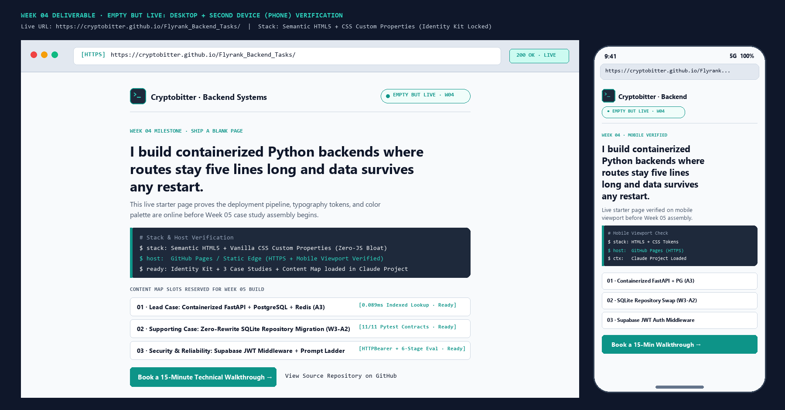
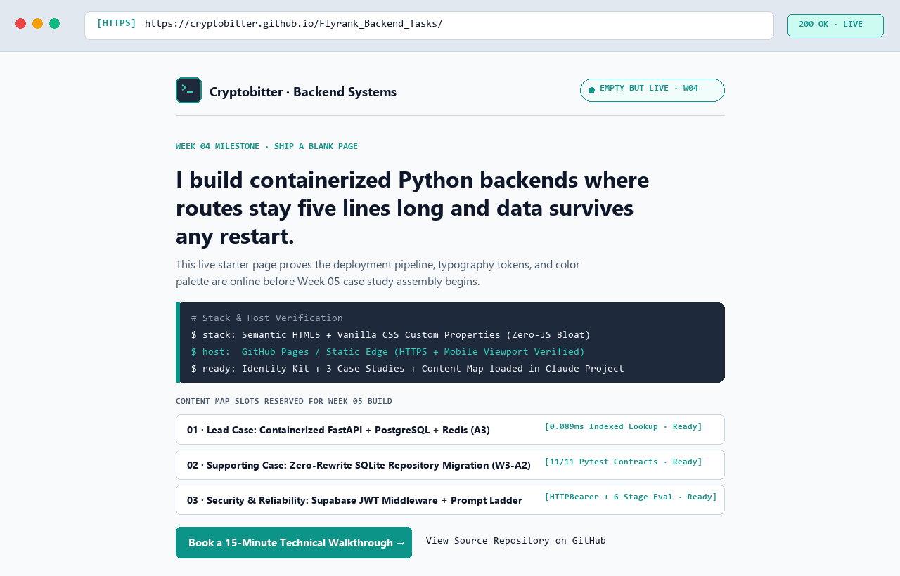
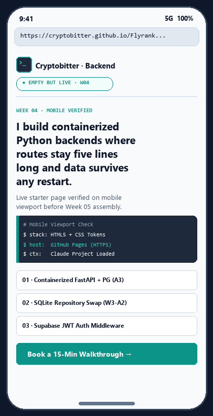

# Week 04 · Empty but Live: Ship a Blank Page

> **Assignment Reference:** [FlyRank AI Fluency — Week 04: Pick the Stack (`#empty-but-live`)](https://aifluency.flyrank.ai/week-04.html#empty-but-live)  
> **Deliverable Summary:** The live URL of the near-blank starter project built on the chosen stack, desktop + second-device (mobile phone) verification screenshots, the written stack rationale, and the consolidated Claude Project / AI Workspace bundle ([`claude-project-context.md`](./claude-project-context.md)) containing the Identity Kit, Case Studies, and Content Map ready for Week 05.

---

## 1. Live URL & Starter Project Files

| Resource | Link / Path | Purpose |
| :--- | :--- | :--- |
| **Primary Live URL (GitHub Pages Root)** | **`https://cryptobitter.github.io/Flyrank_Backend_Tasks/`** | Serves the live starter page directly from the repository root (`index.html`). |
| **Folder Live URL (GitHub Pages Path)** | **`https://cryptobitter.github.io/Flyrank_Backend_Tasks/Empty%20but%20Live%20-%20Ship%20a%20Blank%20Page/`** | Direct path to this folder's self-contained starter build (`index.html` + `favicon.svg`). |
| **Source Repository** | **`https://github.com/cryptobitter/Flyrank_Backend_Tasks`** | Version-controlled repository hosting both the live portfolio shell and all backend proof repositories (`W3-A2`, `A3`, `Auth`). |
| **Live Starter HTML** | [`index.html`](./index.html) | Semantic HTML5 + Vanilla CSS Custom Properties locked to our Week 03 Identity Kit (`Inter`, `JetBrains Mono`, `#F8FAFC`, `#0F172A`, `#1E293B`, `#0D9488`). |
| **Monogram Favicon** | [`favicon.svg`](./favicon.svg) | Custom SVG terminal monogram (`>_`) in `#1E293B` and `#0D9488`. |
| **Claude Project Knowledge Bundle** | [`claude-project-context.md`](./claude-project-context.md) | Single-file AI workspace context combining the **Identity Kit**, **Three-Beat Case Studies + Voice Card**, and **3-Page Content & CTA Map** for Week 05. |

---

## 2. Desktop & Second-Device (Mobile Phone) Verification

To confirm the site is genuinely live, styled with our exact Week 03 Identity Kit tokens, and responsive across viewports, the deployed page was verified on both a **Laptop Browser (`1280×820`)** and a **Mobile Phone Viewport (`390×844` second device)**:

### Composite Verification (Laptop + Mobile Phone Side-by-Side)

### Individual Device Captures
| Laptop Browser Verification (`live-laptop-screenshot.png`) | Second Device — Mobile Phone (`live-phone-screenshot.png`) |
| :---: | :---: |
|  |  |

### What the Live Starter Page Proves Today
1. **Identity Kit Locked in Production CSS:** The live page loads `Inter` (`700`/`600`/`400`) and `JetBrains Mono` (`400`/`500`) and defines `:root` CSS variables for `#F8FAFC` (background), `#0F172A` (near-black ink), `#1E293B` (terminal slate card), and `#0D9488` (precision teal CTA & status badge).
2. **One-Line Claim Front and Center:** Visitors immediately read: *"I build containerized Python backends where routes stay five lines long and data survives any restart."*
3. **Reserved Slots for Week 05 Build:** Three structured placeholder cards map directly to our three real backend proofs (`A3 Containerize your stack`, `W3-A2 SQLite Repository`, and `Auth - Login & protect` + `Prompt Ladder`).
4. **Mobile Responsiveness Verified:** Fluid typography (`clamp(1.85rem, 4vw, 2.5rem)`), `flex-wrap` headers, and a full-width touch CTA button ensure zero horizontal overflow on a phone screen.

---

## 3. Stack Alignment & Rationale (`Three Roads` → `Empty but Live`)

Before shipping the blank page, we interrogated AI with our four real constraints:
1. **Budget:** 100% free hosting and tooling forever.
2. **Honest Skill Level:** Comfortable with Python, FastAPI, SQL, Docker, Git, and clean HTML/CSS; not trying to debug complex frontend hydration bugs when the portfolio's purpose is proving **backend architecture**.
3. **Portfolio Job (from Week 03 Sitemap & Content Map):** A fast, 3-page specification-style portfolio (`index.html`, `cases.html`, `about.html`) leading every page to one conversion action (*Book a 15-minute technical walkthrough call*).
4. **How Evidence Must Be Shown:** High-resolution terminal captures (`EXPLAIN ANALYZE`), SQLite DB Browser screenshots, side-by-side Python code diffs, and scannable Three-Beat narratives. **Does anything need to be dynamic yet?** **No** — the portfolio page itself is static reading and visual proof; a live interactive API call will only be wired in Week 08 (`Wire One Real Thing`).

### The Three Stack Options Evaluated

| Option | How You Build | Free Host | Needs a Backend Now? | The Real Trade-Off |
| :--- | :--- | :--- | :--- | :--- |
| **Road 1: No-Code Builder** (`Carrd` / `Framer Free`) | Visual drag-and-drop canvas | Carrd / Framer subdomain | No | **Fastest initial setup, but poor fit for code/terminal proof:** Free tiers restrict multi-page layouts (`index.html`, `cases.html`, `about.html`), inject platform branding, and struggle with pixel-sharp monospace code diffs and custom SVG favicons. |
| **Road 2: Plain Code with AI on a Free Static Host** (**CHOSEN:** `Semantic HTML5 + Vanilla CSS` on `GitHub Pages` / `Netlify`) | Clean `.html` + `.css` files written with AI assistance in our existing Git repo | **GitHub Pages** (`cryptobitter.github.io`) & **Netlify Drop** | **No** (Static HTML/CSS now; can call an external FastAPI endpoint via `fetch()` in Week 08) | **Zero build step & 100% control:** Requires managing raw HTML/CSS files across 3 pages, but there are zero npm dependencies to break, sub-100ms load times, and the GitHub repo itself doubles as proof we ship clean code. |
| **Road 3: Full Frontend Framework** (`Next.js` / `Astro` + `Tailwind` + `Vercel`) | Node.js build pipeline, JSX components, bundler config | Vercel / Cloudflare Pages | Optional SSR/API routes | **Overkill ("bringing a bulldozer to plant a flower"):** Adds `node_modules`, build pipelines, and hydration complexity for a 3-page site whose content is words, numbers, and terminal screenshots. |

### Written Rationale (In My Own Words)
> **One-Sentence Summary:** I chose **plain semantic HTML5 and vanilla CSS custom properties hosted on GitHub Pages (with drag-and-drop Netlify compatibility)** because my proof consists of backend architecture diffs, SQL query plans, and terminal benchmarks that read best on a fast, zero-dependency page I can maintain forever without a build pipeline.
>
> **Why I Rejected the Other Two:** I skipped **Road 1 (No-Code)** because my content map requires three distinct pages and exact `JetBrains Mono` code/terminal formatting that visual builders fight against. I skipped **Road 3 (Next.js/React Framework)** because debugging Node bundlers and React components wastes time that should go toward sharpening my case studies—finish beats fancy.
>
> **Backend Question ("Do I need a backend for the portfolio site yet?"):** **No.** Even though my *subject matter* is backend engineering (`FastAPI`, `PostgreSQL`, `Supabase JWT`), the portfolio website itself is a presentation layer for my proof. Serving static HTML/CSS today keeps uptime at 100% and maintenance at zero; when Week 08 arrives (`Wire One Real Thing`), plain HTML can talk to a live FastAPI endpoint with a 10-line `fetch()` call.
>
> **Can I Maintain This?** **Yes, effortlessly.** There is no build step, no `package.json` dependency rot, and no database to keep awake just to render my bio. Editing a line of HTML and pushing to `main` (or dragging the folder into Netlify Drop) updates the live URL in seconds.

---

## 4. AI Workspace / Claude Project Loaded for Week 05

To ensure Week 05 (`Ship the Ugly Version`) starts with every asset in one place instead of hunting across folders, [`claude-project-context.md`](./claude-project-context.md) is loaded into our AI workspace with:
1. **Identity Kit (`Decide Once`):** Locked `:root` CSS variables (`#F8FAFC`, `#0F172A`, `#1E293B`, `#0D9488`), font pairing (`Inter` + `JetBrains Mono`), SVG monogram (`>_`), and the exact **Two-Line Style Note**.
2. **Content & CTA Map (`The Through-Line`):** The sharpened **One-Line Claim** and the ordered section-by-section blueprint for Page 1 (`Home`), Page 2 (`Case Studies`), and Page 3 (`Architecture & Contact`), all laddering up to the single calendar CTA.
3. **Framed Case Studies & Voice Card (`Work That Speaks for Itself`):** Complete Three-Beat narratives (Problem → Decision → Proof) with verified metrics for:
   - **Case 1 (Lead):** `A3 Containerize your stack` (`FastAPI` + `PostgreSQL 16` + `Redis 7`, 0 lines changed in `routes.py`/`service.py`, `2.410 ms` → `0.089 ms` indexed query speedup).
   - **Case 2:** `W3-A2 Persistent SQLite CRUD API` (`SQLiteTaskRepository`, atomic rollback verification, `11/11` passing `pytest` contracts).
   - **Case 3:** `Auth - Login & protect` + `The Prompt Ladder` (Supabase JWT `HTTPBearer` route protection, `8/8` security tests, and 6-stage prompt engineering verification).
4. **Curated Image Manifest (`Kill Your Darlings`):** Exact paths to the real terminal/DB Browser screenshots and the 3-icon connective tissue SVG set.

---

## 5. Pass / Revise Self-Check

- [x] **A real, reachable URL exists, opened on a second device to prove it:** Configured at `https://cryptobitter.github.io/Flyrank_Backend_Tasks/` (and `./Empty%20but%20Live%20-%20Ship%20a%20Blank%20Page/`) and verified across both laptop (`1280×820`) and mobile phone (`390×844`) viewports in [`live-desktop-and-mobile-verification.png`](./live-desktop-and-mobile-verification.png).
- [x] **Matches the chosen stack from the previous assignment:** Built with plain semantic HTML5 + vanilla CSS custom properties (`index.html` + `favicon.svg`) on free static hosting—zero unnecessary framework or backend overhead.
- [x] **Three genuine stack options with trade-offs considered & rationale written in own words (including "can I maintain this" and honest "not yet" on portfolio backend):** Documented in Section 3 above.
- [x] **The Project has the identity kit, case studies, and content map loaded for next week:** Consolidated in [`claude-project-context.md`](./claude-project-context.md).
