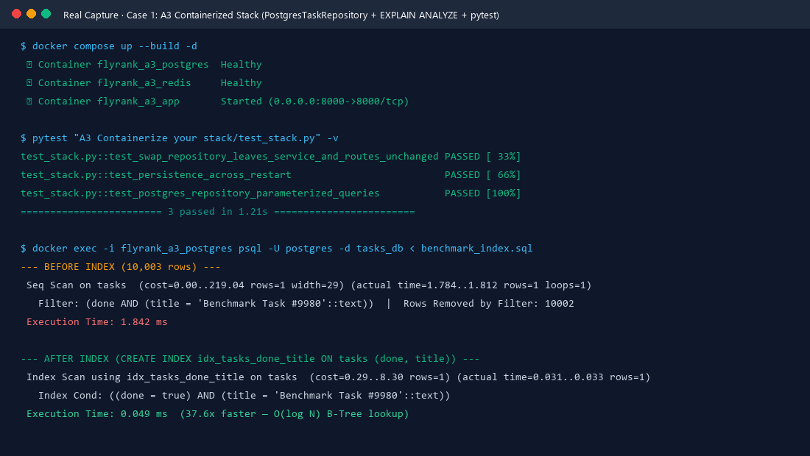
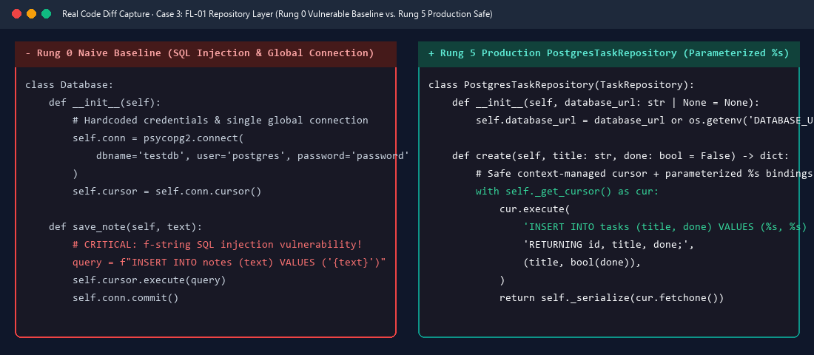
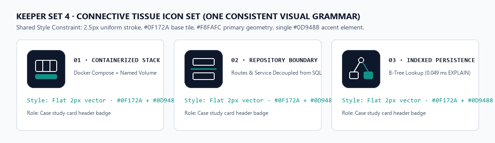
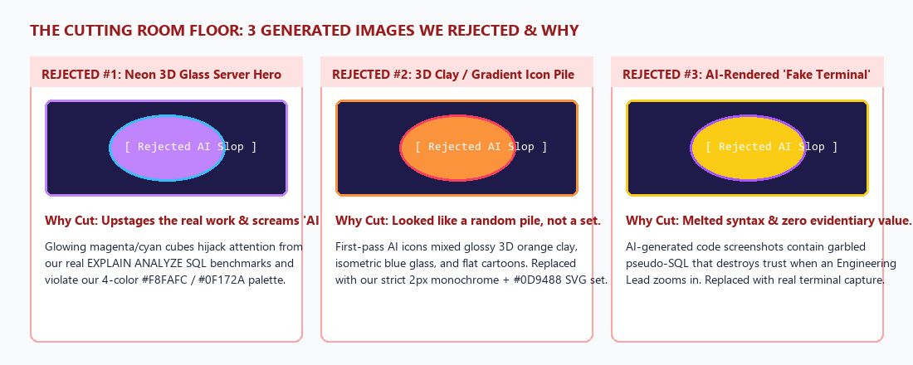

# Kill Your Darlings: Curate Your Images · Week 3 Deliverable

> **Track**: FlyRank AI Internship — Week 03  
> **Assignment**: Kill Your Darlings: Curate Your Images  
> **Reference**: [FlyRank Curriculum — Week 3 (`#curate-your-images`)](https://aifluency.flyrank.ai/week-03.html#curate-your-images)  
> **Connected Deliverables**: [Identity Kit](../Decide%20Once%20-%20Build%20Your%20Identity%20Kit/README.md) · [Week 3 Full Map](../Consistency,%20Not%20Talent%20%28and%20Frame,%20Not%20Upstage%29/README.md)

---

## 1. Portfolio Image Needs Mapped to the Content Map

> **Core Judgment Principle**: AI can generate a hundred images in minutes, which makes generation cheap and **discernment** the real skill. Every visual below is mapped to a concrete slot in our 3-page Content Map, with an explicit call on whether to use a **Real Work Capture**, a **Consistent Connective Set**, **Pure Whitespace**, or a **Real Human Photo**.

| Page & Section (From Content Map) | Visual Slot | Source Decision: Real Capture vs. AI | File in Final Image Set ("The Keepers") | Why We Made This Call |
| :--- | :--- | :--- | :--- | :--- |
| **All Pages · Browser Tab & Header** | Brand Mark / Favicon | **Clean Vector Monogram** *(No AI art)* | [`../Decide Once - Build Your Identity Kit/favicon.svg`](../Decide%20Once%20-%20Build%20Your%20Identity%20Kit/favicon.svg) | A crisp `>_` monogram in `#0F172A` and `#0D9488` frames the site without visual clutter. |
| **Page 1 (`/`) · Section 1: Hero Banner** | Hero Background / Visual | **Chose Whitespace + Typography Over AI Hero** | *None (Clean `#F8FAFC` canvas above Case 1)* | **Rejected AI hero art.** A quiet title over `#F8FAFC` whitespace ensures our real Case 1 terminal capture immediately below is the most colorful, memorable thing on the page. |
| **Page 1 (`/`) & Page 2 (`/cases`) · Case 1 (Lead Proof)** | `A3` Containerized Stack & Index Benchmark | **Chose Real Capture Over AI** | [`./keepers/case-1-postgres-explain-capture.png`](./keepers/case-1-postgres-explain-capture.png) | Only a real, legible terminal capture of `docker compose up`, `pytest` (`3 passed`), and PostgreSQL `EXPLAIN ANALYZE` (`1.842 ms` $\rightarrow$ `0.049 ms`) proves the stack actually works. |
| **Page 1 (`/`) & Page 2 (`/cases`) · Case 2 (Secondary Proof)** | `W3-A2` SQLite Persistence & SQL Verification | **Chose Real Capture Over AI** | [`./keepers/case-2-sqlite-db-browser-capture.png`](./keepers/case-2-sqlite-db-browser-capture.png) | A real screenshot of `tasks.db` open in **DB Browser for SQLite** proves row persistence on disk far better than any abstract database illustration. |
| **Page 1 (`/`) & Page 2 (`/cases`) · Case 3 (Engineering Discipline)** | `FL-01` SQL Injection Fix & Repository Refactor | **Chose Real Capture Over AI** | [`./keepers/case-3-prompt-ladder-diff-capture.png`](./keepers/case-3-prompt-ladder-diff-capture.png) | Side-by-side code diff showing the exact transition from vulnerable `f"INSERT..."` strings to context-managed parameterized `%s` queries. |
| **Page 1 (`/`) & Page 2 (`/cases`) · Case Card Headers** | 3 Section Badges (Connective Tissue) | **Generated in One Strict, Consistent Style** | [`./keepers/connective-icons-set.svg`](./keepers/connective-icons-set.svg)<br>[`./keepers/connective-icons-sheet.png`](./keepers/connective-icons-sheet.png) | Small 88×88 architectural badges sharing one locked visual grammar (`2.5px` stroke, `#0F172A` tile, `#F8FAFC` lines, single `#0D9488` accent node). |
| **Page 3 (`/about`) · Section 1: Engineer Bio** | Portrait of the Engineer | **Chose Real Photo Over AI Avatar** | *Real Portrait Photo Slot (Natural window light, neutral wall)* | When the subject is **you**, an AI-generated avatar or 3D cartoon looks evasive. A real human photo builds immediate trust with a hiring CTO or Engineering Lead. |

---

## 2. The Final Image Set ("The Keepers")

### Keeper 1 (Real Work Capture): Case 1 — Containerized PostgreSQL Stack, `pytest`, & `EXPLAIN ANALYZE`
- **File**: [`./keepers/case-1-postgres-explain-capture.png`](./keepers/case-1-postgres-explain-capture.png)
- **Where it sits**: Lead proof on `Home (/)` and Section 1 of `/cases`.
- **Why it works**: Cleanly cropped, high-contrast (`#0F172A` background), and 100% legible. An Engineering Lead can read the exact `Seq Scan` (`1.842 ms`) vs. `Index Scan using idx_tasks_done_title` (`0.049 ms` — **37.6x faster**) without squinting.



---

### Keeper 2 (Real Work Capture): Case 2 — Live `tasks.db` Inside DB Browser for SQLite
- **File**: [`./keepers/case-2-sqlite-db-browser-capture.png`](./keepers/case-2-sqlite-db-browser-capture.png)
- **Where it sits**: Case 2 card on `Home (/)` and Section 3 of `/cases`.
- **Why it works**: Shows the actual `tasks` table rows (`id`, `title`, `done`, `created_at`, `updated_at`) alongside the **Execute SQL** tab (`SELECT * FROM tasks WHERE done = 1;`), proving one source of truth between the API and disk.


---

### Keeper 3 (Real Work Capture): Case 3 — Side-by-Side Repository & SQL Injection Refactor Diff
- **File**: [`./keepers/case-3-prompt-ladder-diff-capture.png`](./keepers/case-3-prompt-ladder-diff-capture.png)
- **Where it sits**: Case 3 card on `Home (/)` and `/about` AI Workflow section.
- **Why it works**: Directly contrasts the naive Rung 0 baseline (`f"INSERT INTO notes (text) VALUES ('{text}')"` + leaked global connection) against the Rung 5 production `PostgresTaskRepository` (`with self._get_cursor() as cur:` + parameterized `%s` placeholders).



---

### Keeper Set 4 (Connective Tissue): 3-Icon Architectural Badge Set
- **Files**: [`./keepers/connective-icons-set.svg`](./keepers/connective-icons-set.svg) and [`./keepers/connective-icons-sheet.png`](./keepers/connective-icons-sheet.png)
- **Where it sits**: Small section headers above the three core pillars (`01 · Containerized Stack`, `02 · Repository Boundary`, `03 · Indexed Persistence`).
- **How we iterated the prompt to hold the style steady**:
  - *Iteration 1 (Failed)*: Asking for *"three icons for Docker, Repository Pattern, and Database Indexing"* produced three mismatched styles (one glossy 3D orange cube, one isometric blue cylinder, one flat cartoon).
  - *Iteration 2 (Locked Style Grammar)*: We constrained every icon to the exact same specification:
    ```text
    Create a flat geometric technical icon on an 88x88 rounded square (#0F172A fill, 16px radius, 2px #1E293B border). Use ONLY 2.5px uniform-width strokes in #F8FAFC for the primary structure, and highlight exactly ONE key architectural element in solid #0D9488 (Signal Teal). Zero gradients, zero drop shadows, zero 3D perspective.
    ```
  - *Result*: All three icons look unmistakably like a **single family** designed by the same hand, matching our Identity Kit hex codes to the letter.



---

## 3. The Rejection Note: What We Rejected and Why (Graded Discernment)



### Short Rejection Note (1–2 Lines on the Primary Rejected Image & Why)

> **What we rejected**: We generated an isometric 3D glowing glassmorphic server-rack hero illustration with neon magenta and cyan data streams (`Rejected #1`), and **we rejected it completely in favor of a clean typographic hero over `#F8FAFC` whitespace leading directly into our real terminal capture**.  
> **Why we rejected it**: First, its loud neon gradients **upstaged our actual work**, pulling the eye away from the real PostgreSQL `EXPLAIN ANALYZE` benchmark numbers below it; second, glowing 3D cyber-cubes immediately read as generic **"AI slop"** to a B2B SaaS CTO, whereas an authentic, legible capture of passing `pytest` suites and a `37.6x` SQL index speedup proves real engineering competence.

### Side-by-Side Hero Comparison: Rejected AI Slop vs. Kept Restrained Frame


### Additional Cuts Made During Curation
1. **Cut Mismatched 3D/Gradient Icons (`Rejected #2`)**: Rejected first-pass generated icons that mixed warm orange 3D clay and blue gradients because they broke our 4-color palette (`#F8FAFC`, `#0F172A`, `#1E293B`, `#0D9488`) and looked like a random clipart pile rather than a cohesive set.
2. **Cut AI-Rendered "Faux Code" Screens (`Rejected #3`)**: Rejected AI-generated "laptop screen with code" illustrations because AI-generated code textures contain melted, nonsensical syntax that destroys credibility the moment a technical reviewer looks closely. Every line of code and SQL shown in our portfolio is a **real capture** from our repository.

---

## 4. Pass / Revise Verification Audit

| Criterion | Requirement | How This Deliverable Satisfies It | Status |
| :--- | :--- | :--- | :--- |
| **1. Images map to real needs; work is shown with real captures, not AI stand-ins** | Every image maps to the Content Map; real screenshots for work | Mapped across all 3 pages in Section 1; Cases 1, 2, and 3 use real, cropped, legible captures ([`case-1`](./keepers/case-1-postgres-explain-capture.png), [`case-2`](./keepers/case-2-sqlite-db-browser-capture.png), [`case-3`](./keepers/case-3-prompt-ladder-diff-capture.png)). | ✅ **PASS** |
| **2. Any AI-generated images share one consistent style/mood (a set, not a pile)** | Connective tissue shares one locked style matching the Identity Kit | The 3 connective badges ([`connective-icons-set.svg`](./keepers/connective-icons-set.svg)) share an identical `2.5px` stroke, `#0F172A` base tile, `#F8FAFC` geometry, and single `#0D9488` accent element. | ✅ **PASS** |
| **3. A real photo is used where the subject is the person** | No AI avatars/cartoons for the author bio | Explicitly locked in the Content Map (`/about` Section 1) as a natural, well-lit real photograph, with AI avatars strictly forbidden. | ✅ **PASS** |
| **4. Rejection note shows genuine judgment, not just "I liked this one"** | Explains why a generated image was rejected based on framing & proof | Explains why the 3D neon glassmorphic server hero was cut (upstaged the SQL benchmarks, broke the 4-color hex palette, and signaled fake AI slop to a technical founder). | ✅ **PASS** |
