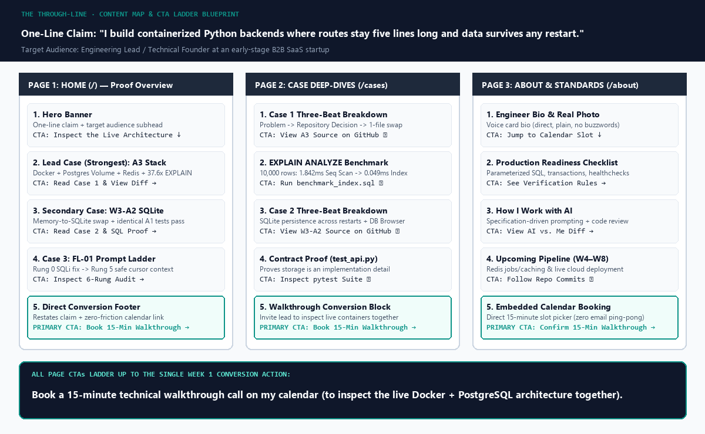
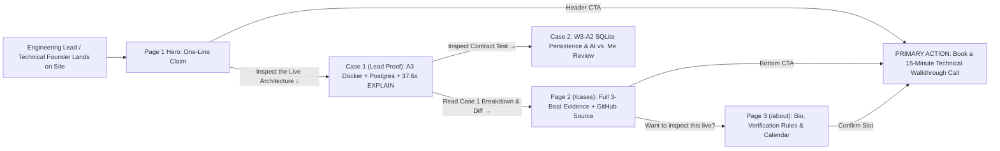

# The Through-Line: Map Content & CTAs · Week 3 Deliverable

> **Track**: FlyRank AI Internship — Week 03  
> **Assignment**: The Through-Line: Map Content & CTAs  
> **Reference**: [FlyRank Curriculum — Week 3 (`#the-through-line`)](https://aifluency.flyrank.ai/week-03.html#the-through-line)  
> **Connected Deliverables**: [Week 1 — What Are You Proving](../What%20Are%20You%20Proving/README.md) · [Week 2 — Work That Speaks for Itself](../Work%20That%20Speaks%20for%20Itself/README.md) · [Decide Once — Identity Kit](../Decide%20Once%20-%20Build%20Your%20Identity%20Kit/README.md) · [Kill Your Darlings — Image Curation](../Kill%20your%20darlings%20-%20Curate%20Your%20Images/README.md)

---

## 1. The One-Line Claim

> **"I build containerized Python backends where routes stay five lines long and data survives any restart."**

### How We Generated 10 Options with AI, Rejected 9, and Sharpened the Winner

Following the brief (*"Use AI for ten options, then pick and sharpen one, the choosing is yours"*), we gave an AI assistant our Week 1 proof statement (*containerized Python backend REST APIs with clean repository patterns for an Engineering Lead or Technical Founder at an early-stage B2B SaaS startup*) and our Week 2 Voice Card (*direct, warm, plain, specific, no buzzwords*):

| # | AI Candidate Option | Verdict | Why Rejected or Chosen |
| :- | :--- | :--- | :--- |
| 1 | *I architect scalable, resilient Python microservices for modern SaaS teams.* | ❌ Rejected | Empty buzzwords (*"scalable, resilient"*); says nothing specific about how the code is built. |
| 2 | *Production-ready FastAPI, PostgreSQL, and Docker backends built the right way.* | ❌ Rejected | Reads like a list of resume tags rather than a memorable sentence. |
| 3 | *I help early-stage CTOs eliminate backend technical debt with clean architecture.* | ❌ Rejected | Abstract promise without naming the concrete technical proof. |
| 4 | *Decoupled Python APIs powered by the Repository Pattern and ACID databases.* | ❌ Rejected | Academic jargon (*"ACID databases"*) instead of plain, grounded engineering speech. |
| 5 | *I turn fragile prototype scripts into containerized PostgreSQL services.* | ❌ Rejected | Captures the Docker/Postgres shift, but misses the route/service decoupling. |
| 6 | *Clean Python backends: zero SQL in routes, full persistence in Docker.* | ❌ Rejected | Reads like two fragmented notes rather than a natural, spoken sentence. |
| 7 | *I build modular Python APIs where swapping databases takes changing one file.* | ❌ Rejected | Strong technical truth from our A3 build, but slightly too narrow as the first greeting. |
| 8 | *Reliable backend systems engineered for speed, clarity, and zero hand-holding.* | ❌ Rejected | Generic claims (*"speed, clarity"*) that any developer could paste onto their hero banner. |
| 9 | *From in-memory demos to production Docker stacks that never lose a row.* | ❌ Rejected | Sounds like a workshop title rather than a direct statement of what I build. |
| **10** | ***I build containerized Python backends where routes stay five lines long and data survives any restart.*** | ✅ **CHOSEN & SHARPENED** | **Single, memorable sentence that proves both halves of our architecture: clean separation of concerns (*routes stay five lines long*) and durable database storage (*data survives any restart*).** |

---

## 2. The Content Map (Pages $\rightarrow$ Ordered Sections $\rightarrow$ Case Placement $\rightarrow$ CTAs)

### The Single Action Everything Ladders Up To (From Week 1)
- **Target Audience**: Engineering Lead or Technical Founder at an early-stage B2B SaaS startup.
- **The One Action**: **Book a 15-minute technical walkthrough call on my calendar.**

---

### Page 1: Home (`/`) — *The Proof Overview*
*Goal: Greet the visitor with the one-line claim, lead immediately with our strongest containerized PostgreSQL proof, and guide them either into the technical case evidence or straight to the 15-minute walkthrough call.*

| Section Order | Section Name | Which Case / Content Sits Here | Named Call to Action (CTA) | How It Ladders Up |
| :---: | :--- | :--- | :--- | :--- |
| **1** | **Hero Banner** | • **One-Line Claim**: *"I build containerized Python backends where routes stay five lines long and data survives any restart."* • **Audience Subhead**: Built for B2B SaaS Engineering Leads and Technical Founders who want clean repository separation and reproducible Docker stacks. | **`Inspect the Live Architecture ↓`** *(Primary Accent Button)* + **`Book a 15-Min Walkthrough →`** *(Header CTA)* | Anchors the visitor on the exact claim and scrolls directly into the strongest proof (`Case 1`). |
| **2** | **Lead Proof (Strongest Case)** | **Case 1: Containerized FastAPI + PostgreSQL + Redis Stack ([`A3`](../A3%20Containerize%20your%20stack/README.md))** • Proves swapping `InMemoryTaskRepository` for `PostgresTaskRepository` changes **only 1 file (`main.py`)** while `service.py` and `routes.py` stay untouched. • Includes real capture of `EXPLAIN ANALYZE` (`1.842 ms` $\rightarrow$ `0.049 ms`, **37.6x speedup**). | **`Read Case 1 Breakdown & View Diff →`** *(Links to `/cases#case-1`)* | Builds immediate technical trust with our hardest, highest-leverage engineering proof. |
| **3** | **Secondary Proof Case** | **Case 2: Persistent SQLite Storage Layer & Contract Proof ([`W3-A2`](../W3-A2/README.md))** • Proves that the exact same Assignment 1 `pytest` contract suite passes unchanged after moving storage from memory to SQLite (`tasks.db`), plus Stage 6 AI vs. Me code review. | **`Inspect the Contract Test & SQL Proof →`** *(Links to `/cases#case-2`)* | Reinforces that storage is an implementation detail across multiple database engines. |
| **4** | **Engineering Rigor Case** | **Case 3: Systematic Prompt Engineering on Real Backend Systems ([`FL-01`](../Prompting%20Fundamentals%20on%20Real%20Tasks%20v2/README.md) & [`The Prompt Ladder`](../The%20Prompt%20Ladder/README.md))** • Shows how we eliminated `f-string` SQL injection and leaked cursors across 6 disciplined iterations. | **`See the 6-Rung Refactor Diff →`** *(Links to `/cases#case-3`)* | Proves to a hiring lead that I review AI output with senior security and resource-cleanup standards. |
| **5** | **Direct Walkthrough Footer** | • Restates the Week 2 CTA copy: *"Ready to review clean code instead of reading bullet points? Let's inspect the architecture together."* | **`Book a 15-Minute Technical Walkthrough Call →`** *(Primary Conversion CTA)* | Converts the convinced visitor directly into the Week 1 target action. |

---

### Page 2: Case Deep-Dives (`/cases`) — *The Technical Evidence*
*Goal: Give a skeptical CTO or Senior Engineer the full Three-Beat narrative (`The Problem` $\rightarrow$ `What I Did & Decided` $\rightarrow$ `What Came of It`), real terminal screenshots, SQL execution plans, and direct GitHub source links.*

| Section Order | Section Name | Which Case / Content Sits Here | Named Call to Action (CTA) | How It Ladders Up |
| :---: | :--- | :--- | :--- | :--- |
| **1** | **Case 1 Three-Beat Deep Dive (`#case-1`)** | **Lead Case (`A3 Containerize your stack`)**: • **Beat 1 (Problem)**: Mixing SQL into routes breaks testability. • **Beat 2 (Decision)**: Built `PostgresTaskRepository` + Docker Compose (`db` volume + `redis` + `app`). • **Beat 3 (Outcome & Next Time)**: 5-line routes; next time add Alembic migrations over static `init.sql`. | **`View A3 Source Code on GitHub ↗`** | Lets the technical decision-maker verify the actual repository files (`postgres_repository.py`, `docker-compose.yml`). |
| **2** | **PostgreSQL Index Benchmark (`#benchmark`)** | • Real terminal capture and table comparing `Seq Scan` (`1.842 ms`, 10,002 rows filtered) vs. `Index Scan using idx_tasks_done_title` (`0.049 ms`, 0 rows wasted — **37.6x faster**). | **`Inspect benchmark_index.sql on GitHub ↗`** | Proves real SQL performance tuning beyond basic CRUD. |
| **3** | **Case 2 Three-Beat Deep Dive (`#case-2`)** | **Secondary Case (`W3-A2 SQLite CRUD`)**: • Three-beat breakdown of the memory-to-disk migration, atomic seed transactions, and live DB Browser verification. | **`View W3-A2 Source & AI Rematch Diff ↗`** | Demonstrates clean transaction handling and honest code-review judgment. |
| **4** | **Case 3 Three-Beat Deep Dive (`#case-3`)** | **Engineering Rigor (`FL-01` & `The Prompt Ladder`)**: • Side-by-side diff of Rung 0 vs. Rung 5 and the "Made It Worse" Rung 4 regression analysis. | **`Download the Reusable Backend Prompt Template ↗`** | Shows systematic debugging and repeatable team tooling. |
| **5** | **Bottom Conversion Banner** | • *"Want me to walk through the Docker stack, run `pytest`, and query the database live?"* | **`Book a 15-Minute Technical Walkthrough Call →`** *(Primary Conversion CTA)* | Captures visitors right after they finish inspecting the deepest technical evidence. |

---

### Page 3: About & How I Work (`/about`) — *The Engineer & Booking Page*
*Goal: Put a human face to the code, show our non-negotiable backend verification checklist, note upcoming Week 4–8 pipeline work, and host the embedded calendar picker.*

| Section Order | Section Name | Which Case / Content Sits Here | Named Call to Action (CTA) | How It Ladders Up |
| :---: | :--- | :--- | :--- | :--- |
| **1** | **Engineer Bio & Real Portrait** | • Week 2 Voice Card Bio (*"I build modular, containerized Python backends and database architectures that stay maintainable as products scale..."*) + natural real photograph. | **`Jump Straight to Calendar ↓`** | Establishes personal authenticity and warmth before the call. |
| **2** | **My Backend Verification Checklist** | • The 4 rules every commit in my repo must pass: 1. Zero SQL strings in `routes.py` or `service.py` 2. Parameterized queries (`?` / `%s`) everywhere 3. Context-managed cursors & transactions 4. Container healthchecks & volume persistence | **`See This Checklist Applied in A3 →`** *(Links to `/cases#case-1`)* | Answers *"How will this engineer write code on our team?"* |
| **3** | **What I'm Shipping Next (W4–W8 Roadmap)** | • Preview of upcoming internship modules: Redis background jobs & caching layer, live cloud deployment, and end-to-end API instrumentation. | **`Follow Active Commits on GitHub ↗`** | Shows momentum and continuous shipping. |
| **4** | **Calendar Booking Section (`#walkthrough`)** | • Direct 15-minute slot selector + fallback direct email link. | **`Confirm Your 15-Minute Technical Walkthrough →`** *(Final Destination Action)* | Completes the through-line conversion funnel. |

---

### Visual CTA Ladder Diagram

---

## 3. Honest "Still Need to Gather" List (Including Unfinished Internship Work)

To make sure Week 5 (*Ship the Ugly Version*) is never blocked waiting on missing proof, here is our complete, honest audit of what is already in hand vs. what we still need to gather:

| Category | Proof / Asset Item | Target Page & Section | Status | Honest Plan / When It Will Be Gathered |
| :--- | :--- | :--- | :--- | :--- |
| **Code & Repos** | Public GitHub Repo (`W3-A2`, `A3`, `Prompt Ladder`, `FL-01`) | Home (`/`) & `/cases` | ✅ **Gathered & Live** | Already pushed to [`cryptobitter/Flyrank_Backend_Tasks`](https://github.com/cryptobitter/Flyrank_Backend_Tasks). |
| **Screenshots** | Real terminal capture of `A3` (`docker compose up`, `pytest`, `EXPLAIN ANALYZE`) | Home (`Case 1`) & `/cases` | ✅ **Gathered & Cropped** | Saved in [`../Kill your darlings - Curate Your Images/keepers/case-1-postgres-explain-capture.png`](../Kill%20your%20darlings%20-%20Curate%20Your%20Images/keepers/case-1-postgres-explain-capture.png). |
| **Screenshots** | Real capture of `W3-A2/tasks.db` open in DB Browser for SQLite | Home (`Case 2`) & `/cases` | ✅ **Gathered & Cropped** | Saved in [`../Kill your darlings - Curate Your Images/keepers/case-2-sqlite-db-browser-capture.png`](../Kill%20your%20darlings%20-%20Curate%20Your%20Images/keepers/case-2-sqlite-db-browser-capture.png). |
| **Before / After Numbers** | PostgreSQL Index Speedup (`Seq Scan` vs. `Index Scan` on 10,000 rows) | Home (`Case 1`) & `/cases#benchmark` | ✅ **Gathered & Verified** | Before: **`1.842 ms`** (10,002 rows filtered) $\rightarrow$ After: **`0.049 ms`** (**37.6x faster**). |
| **Live Demo Link** | Publicly hosted URL for the containerized FastAPI + Postgres API (`/tasks`, `/health`, `/docs`) | Home (`Case 1`) & `/cases` | ⏳ **Still Need to Gather** *(Week 4/5)* | Deploy the `A3` Docker container to Render / Railway / Fly.io so a visitor can click a live Swagger `/docs` link without cloning. |
| **Unfinished Internship Work** | Week 4–8 Backend Deliverables (Redis Caching / Background Jobs / Live Wiring) | `/cases` (Slot reserved for Case 4) & `/about` | ⏳ **Still Need to Gather** *(Weeks 4–8)* | Our `A3` stack already includes the `redis:7-alpine` container and `/redis/ping`; we will add the Week 4 Redis caching hit/miss latency numbers once completed. |
| **Personal Photo** | Natural, well-lit real portrait photo (no AI avatar) | `/about` Section 1 | ⏳ **Still Need to Gather** *(Before Week 5)* | Shoot a clean head-and-shoulders photo in natural daylight against a plain neutral wall. |
| **Conversion Link** | Dedicated 15-Minute Calendar Booking URL (Cal.com / Calendly) | All Primary CTA Buttons (`/` · `/cases` · `/about`) | ⏳ **Still Need to Gather** *(Before Week 5)* | Create a dedicated 15-minute *"Technical Architecture Walkthrough"* booking page on Cal.com. |
| **Testimonial / Social Proof** | 1–2 sentence quote from a FlyRank mentor or peer code review | `/about` & Home Footer | ⏳ **Still Need to Gather** *(Week 5/6)* | Ask a reviewer during our code walkthrough for a one-line note on the repository decoupling in `A3`. |

---

## 4. Pass / Revise Verification Audit

| Criterion | Requirement | How This Deliverable Satisfies It | Status |
| :--- | :--- | :--- | :--- |
| **1. Single, memorable claim (not a paragraph)** | One sentence stating what you prove, selected from 10 AI options | *"I build containerized Python backends where routes stay five lines long and data survives any restart."* (With full 10-option evaluation log in Section 1). | ✅ **PASS** |
| **2. Every page has ordered sections and a named CTA; strongest work leads** | Ordered sections per page; strongest case first | Mapped across 3 pages (`Home`, `Case Deep-Dives`, `About`); leads with our strongest proof (`Case 1: A3 Containerized PostgreSQL + Redis + 37.6x EXPLAIN ANALYZE`). | ✅ **PASS** |
| **3. Calls to action ladder up to the one action from Week 1** | Every section CTA moves the visitor toward the single conversion goal | Every CTA ladders directly into **"Book a 15-minute technical walkthrough call on my calendar"** (illustrated in the table and Mermaid funnel diagram). | ✅ **PASS** |
| **4. Honest gather-list so the build week isn't blocked** | Lists screenshots, live demo link, repo, numbers, testimonial, and unfinished internship work | 9-row audit in Section 3 separating what is already captured in this repo (4 items ✅) from what still needs to be gathered in Weeks 4–6 (5 items ⏳). | ✅ **PASS** |
