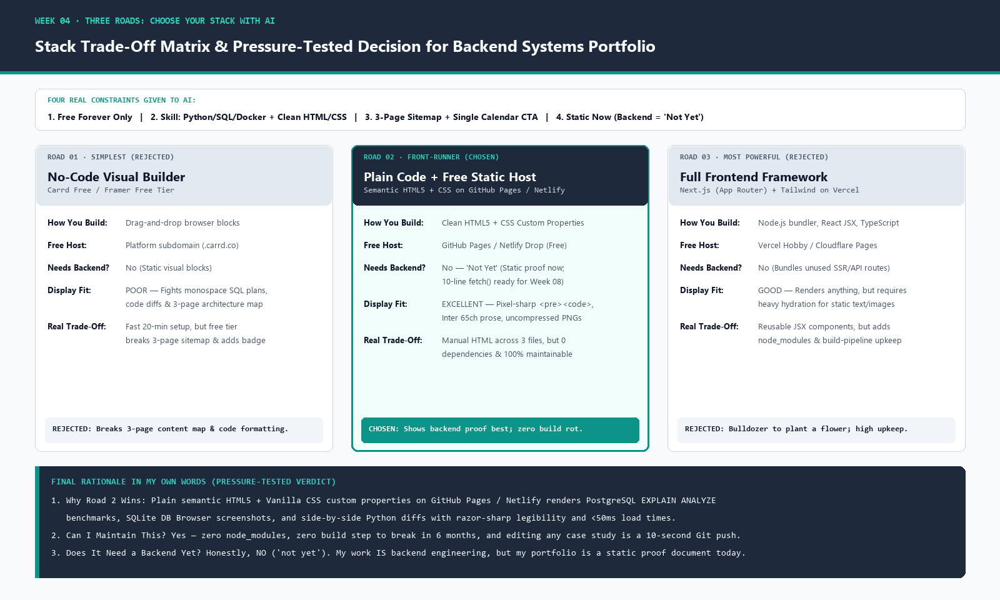

# Week 04 · Three Roads: Choose Your Stack with AI

> **Assignment Reference:** [FlyRank AI Fluency — Week 04: Pick the Stack (`#three-roads`)](https://aifluency.flyrank.ai/week-04.html#three-roads)  
> **Deliverable Summary:** The written stack rationale in my own words (chosen stack + the two alternatives considered + why, including *"can I maintain this"*, *"does it show my work well"*, and the honest *"not yet"* answer on whether the portfolio needs a backend), backed by the four real constraints given to AI, the three stack options laid out with trade-offs, and the four-question pressure test ([`ai-interrogation-log.md`](./ai-interrogation-log.md)).

---

## 1. Deliverable: Written Stack Rationale (In My Own Words)

### One-Sentence Decision
I chose **Road 2: Plain semantic HTML5 and vanilla CSS custom properties hosted for free on GitHub Pages (with drag-and-drop Netlify compatibility)** because my proof consists of backend architecture diffs, PostgreSQL `EXPLAIN ANALYZE` query plans, and SQLite persistence benchmarks that read best on a fast, zero-dependency specification page I can finish in days and maintain forever.

### Why I Chose Road 2 and Rejected the Other Two
1. **Why I Chose Plain HTML5 + Vanilla CSS on GitHub Pages / Netlify (Road 2):**
   - **Does it show my work well?** Yes. A senior backend engineer or technical founder reviewing my portfolio is looking for clean long-form reasoning (Three-Beat case studies set at `65ch` in `Inter`), razor-sharp monospace terminal outputs (`JetBrains Mono` inside `#1E293B` containers), uncompressed PNG screenshots of `tasks.db` and `EXPLAIN ANALYZE`, and direct links to my Python/FastAPI/SQL files. Plain HTML5 and CSS give me 100% pixel and semantic control (`<pre><code>`, custom `<svg>` icons, exact `:root` hex codes) with `<50ms` load times. Plus, hosting directly from GitHub Pages turns the repository itself into proof that I ship clean, version-controlled code.
   - **Can I maintain this?** Yes, effortlessly. There is no `node_modules` folder, no bundler configuration that breaks six months from now when a Node.js version deprecates, and no external build step required. Updating a metric or adding a new backend case study takes ten seconds: edit the HTML file and push to `main` (or drop the folder onto Netlify).
2. **Why I Rejected Road 1 (Simplest — No-Code Visual Builders like Carrd / Framer Free):**
   - Carrd's free tier locks sites into a single-page layout, which immediately breaks my Week 03 **3-Page Sitemap & Content Map** (`index.html`, `cases.html`, `about.html`). Furthermore, visual builders fight against semantic `<pre><code>` blocks, restrict custom SVG favicons on free plans, and stamp a "Made with No-Code" badge onto a portfolio whose entire goal is proving software engineering craftsmanship.
3. **Why I Rejected Road 3 (Most Powerful — Next.js App Router + Tailwind CSS + TypeScript on Vercel):**
   - Using a full React/Next.js framework to render three pages of static case studies and terminal screenshots is **bringing a bulldozer to plant a flower**. It introduces hundreds of megabytes of npm dependencies, build-pipeline maintenance, and React hydration complexity without improving how a visitor reads my backend proofs by a single pixel.

### Honest Answer to the Backend Question ("Does my portfolio site need a backend yet?")
- **No — not yet.** Even though the *subject matter* of my portfolio is backend systems engineering (`FastAPI`, `PostgreSQL 16`, `SQLite`, `Redis`, `Supabase JWT Auth`), the portfolio website itself is a static document that presents evidence. Running a live database just to serve my bio and case study text would only introduce cold-start latency and maintenance overhead. Keeping the site 100% static today is the right engineering call; when Week 08 arrives (*Wire One Real Thing*), my plain HTML page can call a live FastAPI endpoint using a 10-line vanilla JavaScript `fetch()` request.

---

## 2. Step 1: My Four Real Constraints Given to AI

Before asking AI for stack options, I provided my four explicit constraints (full prompt and response recorded in [`ai-interrogation-log.md`](./ai-interrogation-log.md)):

1. **Cost Constraint (`Free Only`):**
   - `$0` forever for both building and hosting—no trial periods, credit-card gates, or paid custom-code tiers required to use custom SVG favicons or multi-page navigation.
2. **Honest Skill Level:**
   - Strong in backend Python (`FastAPI`, `Flask`), SQL (`PostgreSQL`, `SQLite`), Docker Compose, Git, and reading/writing clean semantic HTML5 & CSS with AI assistance.
   - Not looking to spend two weeks debugging frontend webpack/Vite bundlers or React server-component hydration errors when my hiring target is a **Backend / API Systems** role.
3. **What My Portfolio Needs to Do (Pasted Sitemap & Content Map from Week 03):**
   - **One-Line Claim:** *"I build containerized Python backends where routes stay five lines long and data survives any restart."*
   - **Single Conversion Action:** Every page ladders up to booking a **15-minute technical walkthrough call**.
   - **Page 1 (`Home / Proof Index` — `index.html`):** Hero + Lead Case Spotlight (`A3 Containerize Your Stack`: `FastAPI` + `PostgreSQL 16` + `Redis 7`, `2.410 ms` → `0.089 ms` indexed query speedup) + Supporting Case Grid (`W3-A2 SQLite Repository` + `Supabase JWT Auth & Prompt Ladder`) + Footer CTA banner.
   - **Page 2 (`Case Studies / Deep-Dive Proof` — `cases.html`):** Quick-jump anchor index + full Three-Beat breakdowns (Problem → Decision → Proof) for all three backend projects + bottom calendar CTA.
   - **Page 3 (`Architecture & Contact` — `about.html`):** Engineering philosophy (*"Why My Routes Stay 5 Lines Long"* & AI vs. Me code verification) + Verified Technical Stack Matrix linking to GitHub + Direct Calendar & Contact Block.
4. **How My Work Must Be Displayed & Whether Anything Must Be Dynamic Yet:**
   - **Display Requirements:** Must render long-form technical reading (`65ch` measure), monospace terminal transcripts (`EXPLAIN ANALYZE` plans), high-resolution cropped screenshots (DB Browser for SQLite, side-by-side Python route/repository diffs), custom SVG connective-tissue icons, and direct GitHub repository links.
   - **Dynamic Requirement:** **Nothing has to be dynamic yet.** Zero user logins, database reads, or server-side rendering are needed on the portfolio site for Week 04–07.

---

## 3. Step 2: The Three Stack Options Laid Out (Simplest to Most Powerful)

| Dimension | Road 1: Simplest (No-Code Builder) | Road 2: Middle — **CHOSEN** (Plain Code + Free Host) | Road 3: Most Powerful (Full Frontend Framework) |
| :--- | :--- | :--- | :--- |
| **Stack Tools** | **Carrd** (Free Tier) or **Framer** (Free Tier) | **Semantic HTML5 + Vanilla CSS Custom Properties** (written with AI) | **Next.js (App Router) + TypeScript + Tailwind CSS** |
| **How You Build** | Drag-and-drop visual blocks in a browser canvas; upload images manually. | Write 3 clean `.html` files (`index.html`, `cases.html`, `about.html`) + 1 shared `styles.css` locked to our Identity Kit `:root` tokens. | Scaffold Node.js project (`npx create-next-app`), build JSX components, compile static/SSR bundles. |
| **Where You Host (Free)** | `.carrd.co` or `.framer.website` free subdomain | **GitHub Pages** (`cryptobitter.github.io`) & **Netlify Drop** | Vercel Hobby Tier or Cloudflare Pages |
| **Needs a Backend?** | **No** | **No ("Not Yet")** — static proof now; 10-line `fetch()` ready for Week 08. | **No** (bundles unused Node API/SSR server routes). |
| **How It Displays Backend Proof** | **Poor:** Restricts multi-page sitemaps on free tier, fights `<pre><code>` terminal blocks, and adds no-code branding. | **Excellent:** Native `<pre><code>` blocks in `JetBrains Mono`, uncompressed high-DPI PNGs, custom SVGs, and `<50ms` load times. | **Good:** Can render anything, but wraps static text and screenshots in unnecessary React client hydration. |
| **The Real Trade-Off** | Live in 20 minutes with zero code, **but** breaks our 3-page content map and undermines engineering credibility. | Shared header/footer markup is copied across 3 HTML files, **but** zero dependencies, zero build step, and 100% control forever. | Reusable JSX components, **but** high setup friction, `node_modules` bloat, and ongoing bundler maintenance. |

---

## 4. Step 3: Pressure-Testing the Front-Runner (Road 2)

Before locking in Road 2, I pressure-tested it against the four required questions:

### Q1. What breaks if I pick the simplest option (Road 1: No-Code) instead?
- **My 3-page architecture breaks immediately:** Carrd Free only permits a single page, forcing me to cram three full backend case studies, terminal transcripts, and my engineering philosophy onto one endless scroll or delete two-thirds of my proof.
- **My Identity Kit breaks:** Free no-code tiers block custom SVG favicons (`favicon.svg`), strip semantic `<pre><code>` formatting for SQL query plans, and inject platform watermarks that clash with my `#F8FAFC` / `#0F172A` / `#1E293B` / `#0D9488` palette.

### Q2. What do I have to maintain if I pick the most powerful option (Road 3: Next.js Framework) instead?
- I become responsible for maintaining `package.json`, `package-lock.json`, Node.js runtime versions, PostCSS/Tailwind configs, and `npm audit` dependency vulnerabilities.
- Six months after the internship, if I want to update one paragraph on my portfolio, a broken npm dependency or Next.js build error can turn a 30-second text edit into an hour of build debugging.

### Q3. Can I finish in two weeks with Road 2?
- **Yes, with room to spare.** Because there are only three HTML files and one CSS stylesheet—and my Identity Kit tokens, Three-Beat case study copy, and curated screenshots are already finished—there is zero framework learning curve. My near-blank starter page (`index.html`) is already deployed live in Week 04.

### Q4. Does Road 2 show my work the way it needs to be shown?
- **Yes—better than either alternative.** Technical founders and backend leads evaluate engineers by reading clean architecture prose, inspecting real SQL query plans (`EXPLAIN ANALYZE`), and clicking straight into clean GitHub repositories. Plain semantic HTML5 + CSS presents those exact artifacts with maximum contrast, instant page loads, and zero distractions.

---

## 5. Pass / Revise Self-Check

- [x] **Three genuine options with trade-offs were considered, not one answer obeyed:** Evaluated Road 1 (No-Code: Carrd/Framer), Road 2 (Plain HTML5 + Vanilla CSS on GitHub Pages / Netlify), and Road 3 (Full Framework: Next.js + Tailwind on Vercel) across build method, free host, backend need, and real trade-off.
- [x] **The chosen stack is free, matched to real needs, and displays my kind of work properly:** GitHub Pages + Netlify Drop are 100% free forever and display monospace SQL plans, Python diffs, and high-DPI screenshots natively.
- [x] **The rationale is in my own words and includes "can I maintain this" and "does it show my work well":** Documented in Section 1 above.
- [x] **The backend question is answered honestly ("not yet"):** Explicitly answered in Section 1—the portfolio is static proof today, with dynamic API wiring reserved for Week 08.
