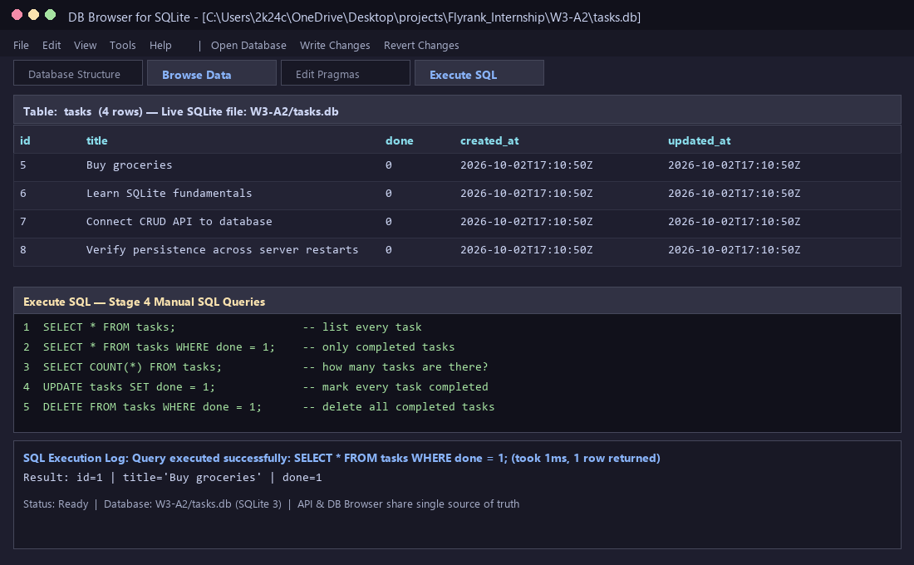

# W3 · A2 — Connecting Your CRUD to the Database (SQLite)

> **Track**: FlyRank Internship · Backend Development Track · Week 3 · Assignment A2  
> **Lane**: Python (`FastAPI` + standard library `sqlite3`)  
> **Database**: SQLite (`tasks.db`)

---

## 1. Overview & Architectural Shift

In Assignment 1, our CRUD API stored tasks in an in-memory Python list (`Client -> API -> List in Memory`). Restarting the server wiped all tasks.

In this assignment, we replaced the storage layer with a persistent **SQLite database** (`Client -> API -> SQLite Database (tasks.db)`) while keeping the API endpoints, request bodies, status codes (`200`, `201`, `204`, `400`, `404`), and response shapes completely identical.

---

## 2. Why SQLite Was Chosen

- **Serverless & Zero Configuration**: SQLite requires no separate database server daemon, user provisioning, or background service—Python's built-in `sqlite3` library connects directly to a local file on disk.
- **Single-File Persistence**: The entire relational schema, indexes, and rows live inside a single portable file (`tasks.db`) that survives server restarts and crashes.
- **True SQL Semantics**: Provides full ACID transactions, parameterized queries (`?` placeholders preventing SQL injection), primary key auto-incrementing, and standard SQL querying—making future migrations to PostgreSQL or MySQL purely a storage-layer swap.

---

## 3. Where the Database File Is Stored

- **File Path**: `W3-A2/tasks.db` (or custom path via `TASKS_DB_PATH` environment variable).
- **Automatic Initialization**: When the FastAPI server starts up (`lifespan` hook calling `database.init_db()`), it automatically creates `tasks.db` if missing, runs `CREATE TABLE IF NOT EXISTS tasks (...)`, and seeds the three starter tasks **only if the table is empty** (`SELECT COUNT(*) FROM tasks` equals `0`).
- **Git-Ignored**: `tasks.db` is listed in `.gitignore` so every developer cloning the repository starts with a clean, automatically seeded database.

---

## 4. How to Start the Project (One Command)

From inside the `W3-A2` directory, run:

```bash
uvicorn main:app --reload --port 3000
```

On first launch, `tasks.db` is created and seeded automatically with three tasks.

---

## 5. Database Viewer Screenshot (DB Browser for SQLite)

Below is the `tasks.db` database opened in **DB Browser for SQLite**, showing the `tasks` table rows alongside the **Execute SQL** tab:



---

## 6. Stage 4 — Manual SQL Query Executed

During Stage 4, we ran the following SQL queries directly against `tasks.db` in DB Browser and verified that `GET /tasks` immediately reflected the changes without restarting the server:

```sql
SELECT * FROM tasks;                   -- list every task
SELECT * FROM tasks WHERE done = 1;    -- only completed tasks
SELECT COUNT(*) FROM tasks;            -- how many tasks are there?
UPDATE tasks SET done = 1;             -- mark every task completed
DELETE FROM tasks WHERE done = 1;      -- delete all completed tasks
```

**Featured Query & Result**:
- **Query**: `SELECT * FROM tasks WHERE done = 1;`
- **What it returned**: It filtered the `tasks` table at the database level and returned only the single row whose `done` column equaled `1` (`{"id": 1, "title": "Buy groceries", "done": 1}`), leaving uncompleted tasks out of the result set.
